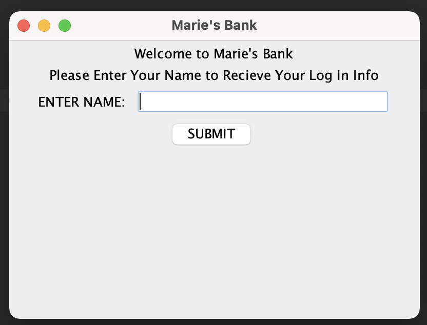

# ATMGUI

## Project Description
This project's goal was to create an banking application with a GUI interface. It takes in the user's name and returns a custom userID and password. This information will be asked for in the log in page. After successfully logging in, it shows a menu that allows the user to pink from a variety of functions (withdraw, deposit, view previous transaction, etc.).

## Languages
Java

## How to Run
Open in your IDE. Create a new object and GUI will pop up.

## How to Use
This would be used by banks in an app/user website. 

## Future Plans
I want to further develop this GUI ATM. More buttons could be added for a wider range of functions. Also, I'd like to work on aesthetics to make it look more like an actual virtual ATM.  

